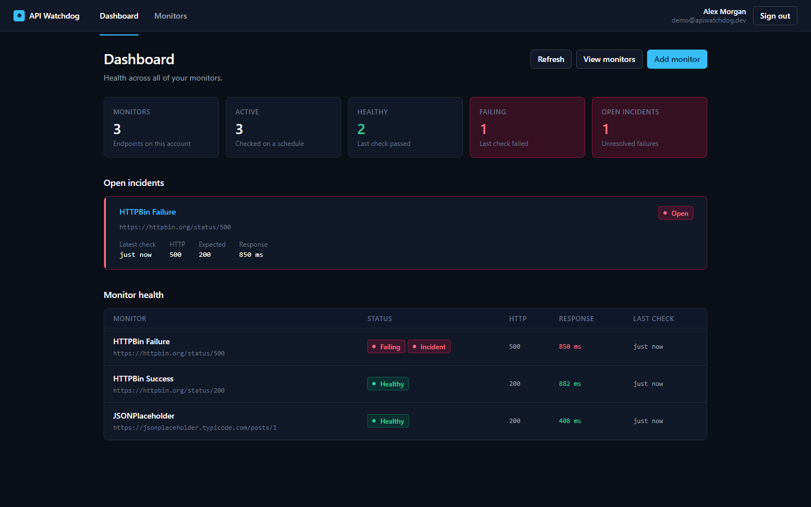
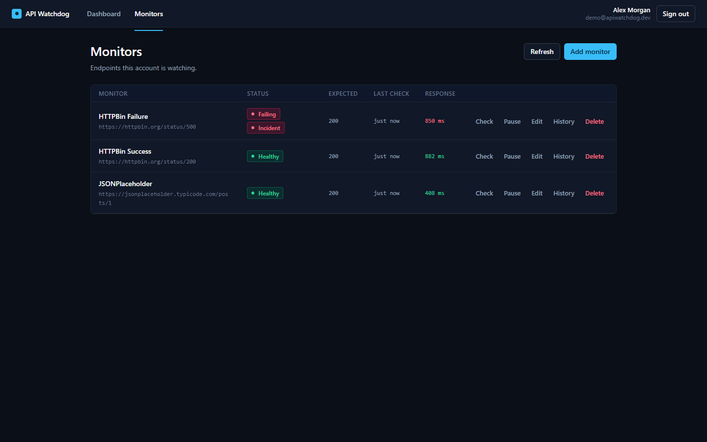
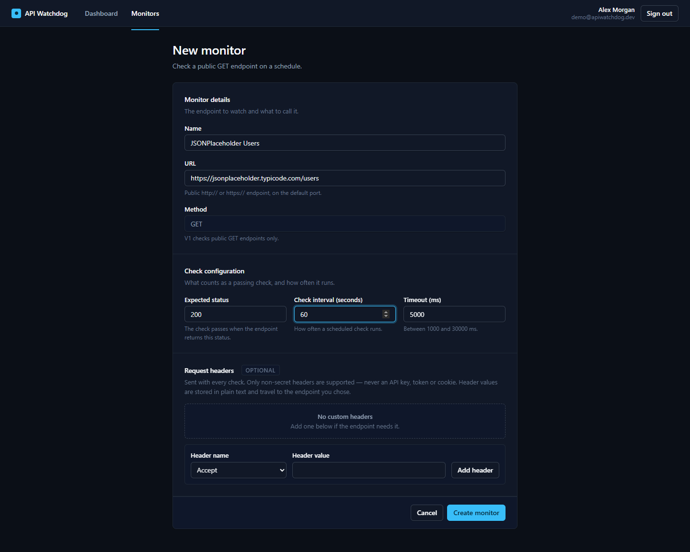
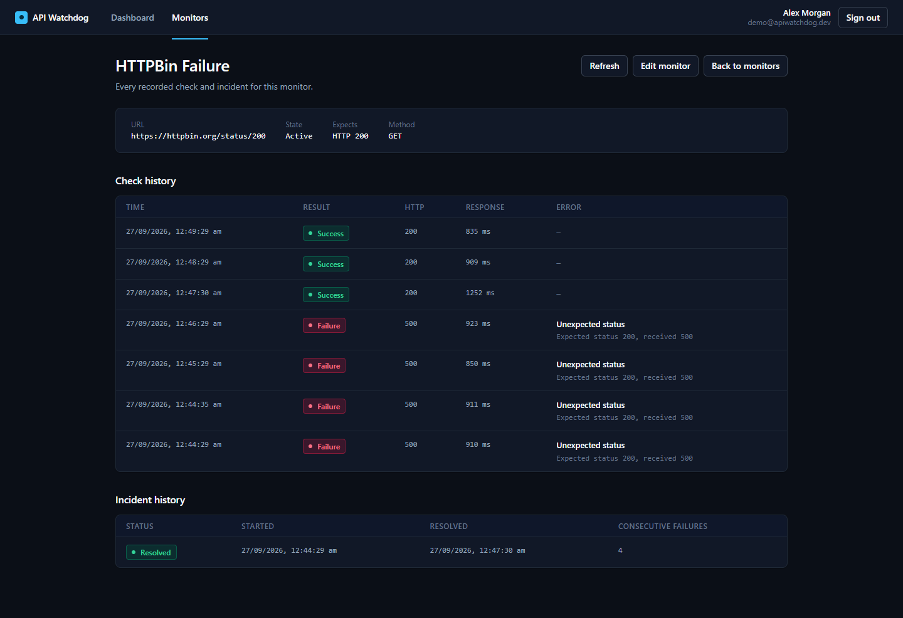
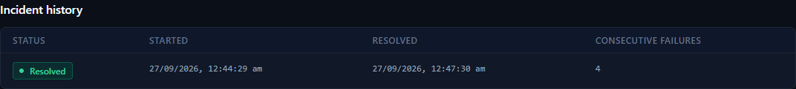
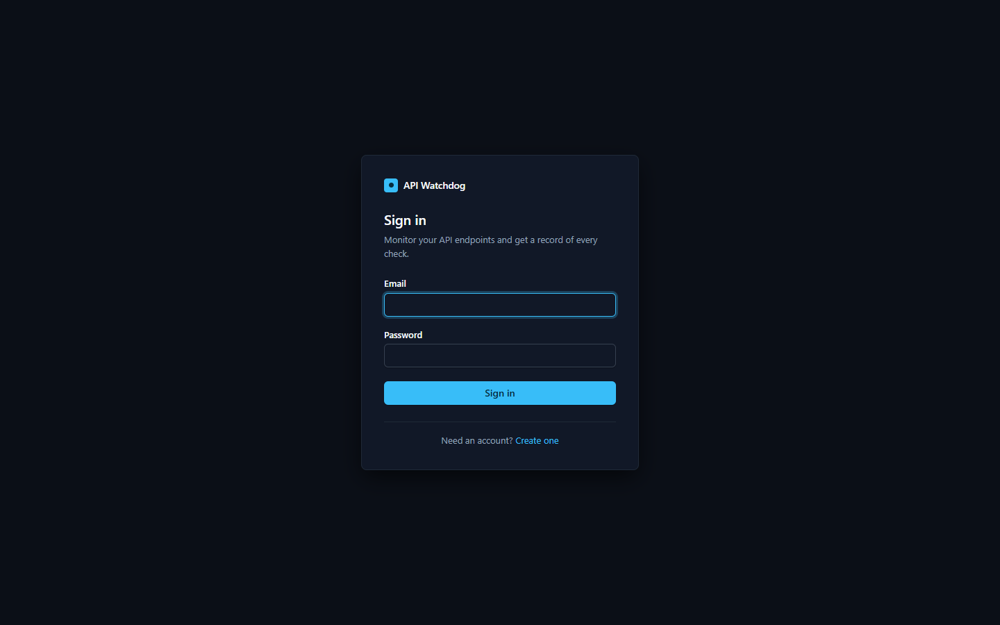
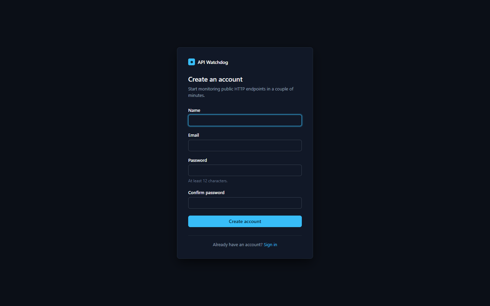
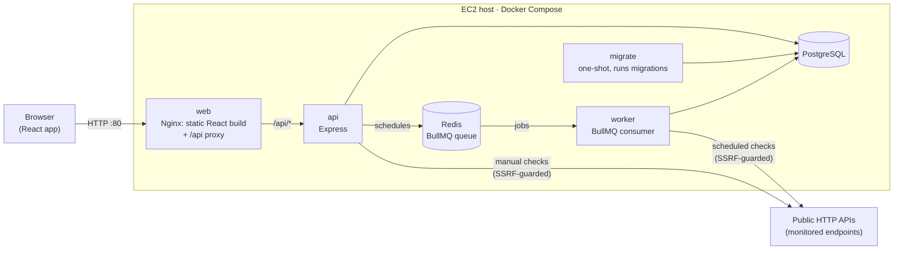
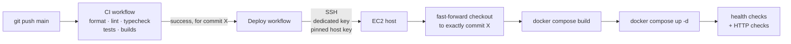

# API Watchdog

A small, self-hosted monitoring service for public HTTP APIs: it checks endpoints
on a schedule, records every result, and opens an incident when an endpoint
keeps failing.

API Watchdog is a production-oriented API monitoring service that periodically
checks public HTTP APIs, records health results, detects repeated failures as
incidents, and shows service health through a dashboard.

**Stack:** React · TypeScript · Node.js · Express · PostgreSQL · Redis · BullMQ ·
Docker · Nginx · GitHub Actions · AWS EC2



## Why I built this

I have spent years building full-stack applications. What I wanted to learn
properly was everything that happens after the code works: running a system that
does work in the background, keeps state it cannot lose, and gets from a
commit to a server without someone copying files by hand.

A monitoring service turned out to be a good vehicle for that, because the core
feature forces the hard parts:

- **Background work and scheduling.** Checks have to run on a timer, outside
  the request cycle, without one slow endpoint holding up the rest. That means
  a queue (Redis + BullMQ) and a separate worker process.
- **State that matters.** Check history and incidents live in PostgreSQL, with
  migrations, and survive restarts and redeploys.
- **Security as part of the feature.** "Fetch a URL a user gave us" is a
  server-side request forgery (SSRF) engine by default. Defending against that
  shaped the check pipeline from the start, not as a later hardening pass.
- **Failure handling.** Timeouts, redirects, DNS failures, a worker killed
  mid-check, Redis restarting, a deploy that doesn't come up healthy.
- **Shipping it.** Docker images, a production Compose stack, CI on every
  change, and a deployment workflow to AWS EC2 that deploys only commits that
  passed CI.

The scope is deliberately small (public `GET` endpoints, individual accounts, no
teams), so that each of those pieces could be built completely rather than just
started.

## Features

- **Accounts:** register, sign in, sign out. Every monitor, check and incident
  belongs to one user, and nobody else can see or change it.
- **Monitors** for public `GET` endpoints, each with:
  - an expected HTTP status (default 200)
  - a check interval
  - a timeout
  - up to 10 optional non-secret request headers
- **Monitor management:** create, edit, pause/resume and delete.
- **Manual check:** "Check now" runs a check immediately and shows the result.
- **Scheduled checks:** run by a separate worker process through a BullMQ queue.
- **Check history:** for each monitor, a paged record of every check, with
  result, HTTP status, response time and a classified error (timeout, DNS,
  connection refused, blocked address, status mismatch, …).
- **Incidents:** opened after consecutive failures (3 by default), and resolved
  by the next successful check. Each monitor has an incident history.
- **Dashboard:**
  - counts of monitors (total, active, healthy, failing) and of open incidents
  - the open incidents
  - each monitor's latest status, HTTP code and response time
- **SSRF protection** on every outbound check. See [Security](#security).
- **Rate limiting** on sign-in/registration, monitor creation and manual checks.
- **Dockerized:** a hot-reloading development stack and a separate production
  stack, both on Docker Compose.
- **CI** on every pull request and every push to `main`: format check, lint,
  type check, tests, builds.
- **Automatic deployment to AWS EC2,** gated on CI passing for the exact commit
  being deployed. It's implemented and verified end to end on the live
  deployment.

## Screenshots

### Monitors



### Adding a monitor



### Check history

A monitor that failed and then recovered. For this demo it first pointed at
`https://httpbin.org/status/500` while expecting 200, and was then edited to
`/status/200`; the page header shows the current target. Each row is one check:
failures with the HTTP status that caused them, then successes.



### Incidents

Incident history for the same monitor. The incident opened when the third
consecutive failure was recorded, and its start time is the first failure of
that run. It was resolved by the first successful check, after four failures in
a row. While an incident is open it also appears on the dashboard, as in the
screenshot at the top.



### Sign in and registration

<p>
  
  
</p>

## Architecture



- **One origin.** The browser only talks to Nginx. Nginx serves the React build
  and proxies `/api/*` to the Express API, so the API needs no CORS
  configuration.
- **The API owns requests and schedules.** It never runs scheduled checks.
  Creating, editing, pausing or deleting a monitor updates its BullMQ job
  scheduler in Redis.
- **The worker runs the checks.** A slow or hostile endpoint then ties up the
  worker, not the event loop serving the dashboard. The one exception is a
  manual "Check now", which runs in the API so the result can be returned
  immediately.
- **PostgreSQL is the source of truth.** A job carries only a monitor id; the
  worker reads the monitor from the database before checking it. On startup the
  API reconciles the Redis schedules against PostgreSQL, so a flushed or
  restarted Redis heals itself.
- **Migrations run as their own service.** The one-shot `migrate` container
  runs before the API and worker start, never from inside the API.

### CI/CD



## Tech stack

| Area                  | Technology                                                      |
| --------------------- | --------------------------------------------------------------- |
| Frontend              | React 19, TypeScript, Vite, React Router                        |
| Backend               | Node.js 24, Express 5, TypeScript                               |
| Data                  | PostgreSQL 16 (`pg`, `node-pg-migrate`), Redis 7 (`ioredis`)    |
| Background processing | BullMQ                                                          |
| Validation and auth   | Zod, bcrypt, JSON Web Tokens, express-rate-limit                |
| Infrastructure        | Docker, Docker Compose, Nginx, AWS EC2                          |
| CI/CD                 | GitHub Actions                                                  |
| Testing               | Vitest, Supertest, React Testing Library, jsdom                 |
| Tooling               | npm workspaces, ESLint, Prettier                                |

## How it works

1. **A user creates a monitor.** The request body is validated with Zod.
   Unknown fields are rejected, and the URL goes through a static guard:
   `http`/`https` only, default ports only, no embedded credentials, and a
   length limit.
2. **The API stores it and schedules it.** The monitor is written to
   PostgreSQL, and a BullMQ job scheduler keyed by the monitor's id is created
   in Redis, repeating at the monitor's interval. Edits update the scheduler,
   and pausing or deleting removes it.
3. **The worker receives a job.** It carries only the monitor id, so the worker
   reloads the monitor from PostgreSQL and skips it if it was paused or deleted
   in the meantime.
4. **The worker performs a guarded check.**
   - The hostname is resolved, and every address must be public.
   - The connection is pinned to the address that was approved.
   - Each redirect is validated again.
   - The response body is never read.

   See [Security](#security) for the details.
5. **The result is recorded.** Status, HTTP status, response time and a
   classified error are written in the same database transaction as any
   incident change, so a check and its incident transition can't disagree.
6. **Repeated failures open an incident.** Once the number of consecutive
   failures reaches the threshold (3 by default), an incident opens. The count
   is recomputed from stored checks rather than incremented, so a redelivered
   job can't inflate it.
7. **A success resolves it.** The first successful check closes the open
   incident.
8. **The dashboard reads the results.** It shows current health, open
   incidents and each monitor's latest check. The history page shows every
   check and incident for one monitor.

## Security

The core feature makes an HTTP request to any URL a user types in. Without
care, that turns the server into a proxy into its own network (SSRF): cloud
metadata endpoints, databases, other containers. Most of the security work is
about that.

**Outbound checks (SSRF)**

- **Scheme and port allowlist:** `http` on port 80 and `https` on port 443,
  nothing else. URLs containing a username or password are rejected.
- **Addresses are validated after DNS resolution, against an allowlist.**
  Every resolved address must fall in a range recognised as public unicast.
  Everything else is refused, IPv4 and IPv6 alike:
  - private, loopback and link-local (which includes `169.254.169.254`, the
    cloud metadata endpoint)
  - carrier-grade NAT, documentation, benchmarking, multicast and reserved
    ranges
  - IPv4-mapped IPv6 addresses

  An address the rules don't recognise is refused, not allowed.
- **Hostnames are never judged by name.** An attacker's own domain can resolve
  to `10.0.0.5`, so only the resolved address counts. Inside Docker, service
  names such as `postgres` or `redis` resolve to private addresses and are
  blocked for that reason.
- **Connection pinning.** The socket connects to the exact address that passed
  validation, through the resolver hook, so a DNS answer that changes between
  check and connect (DNS rebinding) cannot redirect it. Connection reuse is off,
  so a pooled socket can't carry a request to the wrong host.
- **Redirects are re-validated.** At most 3 are followed, and each hop goes
  through the same URL and address checks.
- **Resource limits:**
  - one timeout covers the whole check, redirects included
  - response headers are capped by size and count
  - the response body is never read and never stored
  - TLS certificate verification is never relaxed
- **No permissive mode.** No configuration flag or environment variable can
  weaken these rules, in any environment.

**Request headers**

- Monitors may carry non-secret headers only. `Authorization`,
  `Proxy-Authorization`, `Cookie`, `Set-Cookie`, `X-Api-Key` and `Api-Key` are
  rejected when a monitor is saved.
- Names must be valid header tokens, and values printable ASCII with no CR/LF,
  which prevents header injection. There are at most 10 per monitor.
- `Host`, `User-Agent` and `Accept-Encoding` are always set by the client and
  cannot be overridden.
- Header values are never logged, and validation errors name the header, never
  its value.

**Accounts and access**

- **Passwords:** hashed with bcrypt (cost 12) and never stored or logged in
  plain text.
- **Sign-in:** does the same bcrypt work for unknown emails, so neither the
  error nor the response time reveals which emails are registered.
- **Tokens:** HS256 JWTs that expire after 24 hours. The signing secret must be
  at least 32 characters, or the API refuses to start.
- **Ownership is checked on every resource.** Every monitor query is scoped to
  the signed-in user. Another user's monitor is indistinguishable from one that
  doesn't exist (404).
- **Rate limits:**
  - sign-in and registration: 10 per 15 minutes per IP
  - monitor creation: 30 per 15 minutes per IP
  - manual checks: 10 per 5 minutes per user

  Behind Nginx, Express trusts exactly one proxy hop, so limits apply to the
  real client address and a spoofed `X-Forwarded-For` doesn't help.
- **Other limits:** request bodies are capped at 100 KB, and each user can own
  at most 20 monitors.

**Configuration and deployment**

- **Secrets:** all configuration comes from environment variables and is
  validated at startup. `.env` files are gitignored and kept out of Docker
  images. Production secrets exist only on the server.
- **Containers:** the application containers (API, worker, migrations and
  Nginx) run as non-root users. In production only
  Nginx publishes a port; the API, PostgreSQL and Redis are reachable only
  inside the Docker network.
- **Deployment access:** deployment uses a dedicated SSH key and a pinned host
  key. GitHub holds no AWS credentials.

Tests exercise these rules with real attack inputs: private and metadata
addresses, redirects to internal hosts, rebinding-style DNS answers, forbidden
headers, and cross-user access.

## Local development

**Prerequisites:** Docker with Compose, and Node.js 24 (the version in `.nvmrc`)
for running tests, linting and migrations from the host.

```bash
npm install
cp .env.example .env                           # local defaults; never commit it
cp apps/web/.env.example apps/web/.env.local
docker compose up -d --build
```

Open <http://localhost:5173> and register an account.

`docker compose up` starts PostgreSQL, Redis, the API, the worker and the Vite
dev server, with hot reload. A one-shot `migrate` service applies the database
migrations before the API and worker start, so a fresh clone needs no separate
schema step.

```bash
docker compose ps                     # service status and health
docker compose logs -f api worker     # follow the API and worker
docker compose down                   # stop; the database volume is kept
docker compose down -v                # stop and delete the database
```

**Running the apps on the host instead** (faster edit loop), with only the
databases in Docker:

```bash
docker compose up -d postgres redis
npm run db:migrate
npm run dev              # API on http://localhost:3000
npm run dev:worker       # background worker
npm run dev:web          # frontend on http://localhost:5173
```

Don't run the containerised and host versions at the same time. Two workers
would consume the same queue, and two APIs would both try to bind port 3000.

Every environment variable is declared and validated in
`packages/shared/src/config.ts`, and the application refuses to start if one is
missing or malformed. `.env.example` documents them.

**Checks:**

```bash
npm run verify           # format check, lint, type check and all tests (CI also runs both builds)
npm test                 # tests only
npm run build            # compile the shared package and the API
npm run build:web        # production frontend bundle
```

The backend tests need PostgreSQL and Redis from Compose, but they use their own
database (the development database name with a `_test` suffix, created and
migrated automatically) and their own Redis key prefix. Your development data is
never touched.

## Production deployment

Production runs `docker-compose.prod.yml` on a single EC2 instance:

```
Browser ──HTTP :80──▶ EC2 ──▶ web (Nginx) ──┬── /       static React build
                                            └── /api/*  api ──▶ PostgreSQL, Redis ◀── worker
```

- **web:** Nginx serves the static frontend build and proxies `/api`. It's the
  only container with a published port. The image is a multi-stage build, so
  Node and the source never ship in it.
- **api** and **worker:** the same image, compiled TypeScript run with `node`
  directly, so shutdown signals reach the process and in-flight requests and
  checks drain on redeploy.
- **migrate:** runs pending migrations once per deployment, before the API and
  worker start. A failed migration stops the rollout.
- **PostgreSQL:** data lives in a named Docker volume.
- **Redis:** append-only-file persistence on a volume, so job schedules survive
  a Redis restart.
- **Health checks:** PostgreSQL, Redis, the API (`/health`) and Nginx have
  Docker health checks. Services start in dependency order and wait for health.
- **Secrets:** a server-only `.env.production`, never in Git and never in an
  image. Container logs are rotated.

**HTTPS is not currently enabled in the demo deployment.** The application is
intentionally HTTP-only for the current portfolio deployment; HTTPS is a
planned hardening step.

The same production stack runs locally: `npm run prod:up`, then
<http://127.0.0.1:8080>. The full operational guide covers the production
environment file, networking, migrations, Redis persistence, one-time EC2 and
SSH setup, and rollback. It's in **[docs/deployment.md](docs/deployment.md)**.

## CI/CD

CI-gated automatic deployment to AWS EC2 is implemented and has been verified
end to end: a push to `main` passes CI, and the tested commit is deployed to the
EC2 instance and health-checked, with no manual step.

- **CI** (`.github/workflows/ci.yml`) runs on every pull request and every push
  to `main`, against real PostgreSQL and Redis service containers: format check,
  lint, type check, the full test suite, the backend build and the frontend
  build.
- **Deploy** (`.github/workflows/deploy.yml`) is triggered by CI finishing, not
  by the push. It deploys only when CI succeeded for a push to `main`, and it
  deploys **exactly the commit CI tested**. If a newer commit landed in the
  meantime, it waits for its own CI run.
- **How deployment reaches the server:**
  - The runner connects over SSH with a **dedicated deployment key**. That key is
    separate from the key the server uses to pull from GitHub.
  - The server's **host key is pinned**, so the runner refuses to connect to
    anything else.
  - GitHub holds **no AWS credentials**, and `.env.production` never leaves the
    server.
- **On the server,** `scripts/deploy.sh`:
  - fast-forwards the checkout to the tested commit, and never moves backwards
  - builds the images, then runs `docker compose up -d`. It never runs `down`,
    so the site stays up during the build, and volumes are never touched.
  - fails the run unless, within 180 seconds, the API and web report healthy,
    the worker stays up, `/` returns 200 and `/api/auth/me` returns 401
  - on failure, prints container status and recent logs
  - keeps the previous healthy images tagged for a manual rollback. There is no
    automatic rollback.
- **Switching automatic deploys on or off** takes one repository variable
  (`DEPLOY_ON_PUSH`). It's on for this deployment. A manual run from the Actions
  tab is always available.

## Database backups

No automated backup is set up yet. PostgreSQL data lives in a Docker volume on
the EC2 instance's disk, so losing the instance or its volume loses the data.
Backups are an open item (see [Known limitations](#known-limitations)).

## Project structure

```
apps/
  api/                 Express API and BullMQ worker (TypeScript)
    src/checks/        SSRF guard, safe DNS resolution, HTTP client, check runner
    src/incidents/     incident open/resolve logic
    src/queue/         BullMQ queue, schedulers, startup reconciliation
    src/monitors/      monitor routes, validation, repository
    src/auth/          registration, sign-in, password hashing, tokens
    src/index.ts       API entry point
    src/worker.ts      worker entry point
    test/              integration and unit tests
    Dockerfile         image for the API, worker and migrations
  web/                 React frontend (Vite)
    src/               routes, features, components
    test/              component and routing tests
    Dockerfile         development image (Vite dev server)
    Dockerfile.prod    production image (static build served by Nginx)
    nginx.conf         SPA fallback, caching, /api proxy
packages/shared/       environment loading and validation
migrations/            database migrations (node-pg-migrate)
scripts/deploy.sh      build, roll out and verify on the production host
docs/deployment.md     production stack and deployment guide
.github/workflows/     ci.yml, deploy.yml
docker-compose.yml     development stack
docker-compose.prod.yml  production stack
```

## Testing

The suite runs with [Vitest](https://vitest.dev/), with `npm test` locally and
on every CI run.

- **Backend:**
  - integration tests drive the real Express app through Supertest, against
    real PostgreSQL and Redis
  - authentication, per-user ownership boundaries, monitor CRUD, scheduling,
    the worker, incidents, the dashboard and history
- **Security-sensitive units:**
  - URL guard, IP classification, safe DNS resolution
  - the HTTP client, against local test servers: redirects, timeouts, oversized
    headers, blocked addresses
  - rate limiting and proxy trust
- **Frontend:** React Testing Library tests for authentication flows, routing
  and guards, the dashboard, monitor forms and lists, and history pages.

## Known limitations

- **HTTP only.** HTTPS is not enabled in the demo deployment yet.
- **Single EC2 instance,** with PostgreSQL and Redis running in the same Docker
  Compose stack rather than as managed services.
- **No automated database backups.**
- **Images are built on the EC2 host** during each deployment, rather than
  pulled from a registry.
- **No automatic rollback.** A failed deployment is reported, and rollback is a
  manual step.
- **Monitoring scope:** public endpoints only, and `GET` only. Authenticated
  APIs can't be monitored, by design in V1.
- **Checks run from one location.** There is no multi-region monitoring.
- **No notifications:** no email, Slack or webhooks. Incidents are visible in
  the dashboard only.
- **Fixed incident threshold.** It is 3 consecutive failures by default, and is
  not yet configurable per monitor from the UI.
- **Rate limits are in memory,** per API process. That's correct for the single
  API instance deployed today, but they would not be shared across replicas.

## Future improvements

These are ideas, not current features:

- HTTPS in front of the deployment
- automated PostgreSQL backups, and possibly a managed database (Amazon RDS)
- building images in CI and deploying from a container registry
- deploying through AWS Systems Manager instead of inbound SSH
- uptime percentages and response-time charts
- notifications (email, Slack, webhooks)
- monitoring authenticated APIs, with encrypted secret storage
- public status pages
- centralised logs and metrics
- checks from multiple regions

## What I learned

- **Asynchronous work belongs outside the request path.** Splitting the API from
  the worker, with a queue between them, made slow checks harmless to the
  dashboard.
- **Queues need a source of truth.** Keeping PostgreSQL authoritative and
  treating Redis schedules as derived data meant a lost Redis could be rebuilt,
  not mourned.
- **SSRF is a design problem, not a filter.** Validating the resolved address,
  pinning the connection to it and re-checking every redirect is what actually
  closes the holes that hostname checks leave open.
- **Docker and Compose,** from development images with hot reload to
  multi-stage production images and a stack where only one port is public.
- **Health checks are what make automation safe.** Startup ordering, deployment
  verification and failure reporting all depend on each service being able to
  say whether it's working.
- **CI/CD end to end:** from a push, through CI, to a deploy that ships only the
  tested commit to a real AWS server.
- **Persistence and failure modes:** volumes, migrations that run once, graceful
  shutdown, and deciding what happens when a deploy fails halfway.

## License

Released under the [MIT License](LICENSE).

## Author

Deep Rathod · [@deeprathod-fullstack](https://github.com/deeprathod-fullstack)
